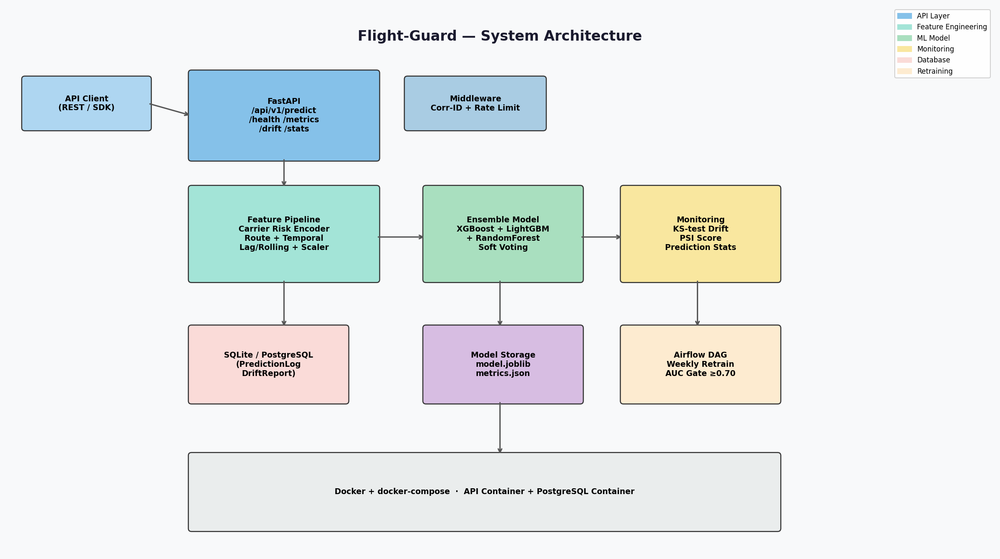

# Flight-Guard ✈️

[](https://github.com/atharvadevne123/Flight-Guard/actions/workflows/ci.yml)
[](https://www.python.org/downloads/)
[](https://opensource.org/licenses/MIT)
[](https://fastapi.tiangolo.com/)

**Real-time flight delay prediction API** using an XGBoost + LightGBM + RandomForest
soft-voting ensemble with carrier risk scoring, route congestion analysis, seasonal
patterns, KS-test drift monitoring, and automated retraining pipelines.

## Overview

Flight-Guard predicts whether a flight will be delayed more than 15 minutes, returning
a calibrated delay probability, a risk tier (`low` / `medium` / `high`), and the model
version — all in a single low-latency API call.

Key capabilities:

- **Ensemble ML** — XGBoost + LightGBM + RandomForest soft-voting classifier with
  5-fold stratified cross-validation (AUC-ROC and accuracy reported).
- **Rich feature engineering** — a six-stage sklearn `Pipeline` producing 17 model
  features: carrier historical delay risk, airport congestion indices, route congestion
  products, distance tiers, cyclical hour/day/month encodings, peak-hour and weekend
  flags, seasonal factors, and composite delay pressure scores.
- **Model monitoring** — every prediction is logged to the database; KS-test and PSI
  drift detection compare a rolling window of recent scores against the training
  reference distribution.
- **Automated retraining** — an Airflow DAG retrains weekly, gated on a minimum CV AUC
  (default 0.70) before promoting the new model.
- **Production middleware** — per-IP rate limiting (200 req/min) and correlation ID
  propagation with structured request logging.

## Setup

### Local development

```bash
git clone https://github.com/atharvadevne123/Flight-Guard
cd Flight-Guard
make install            # pip install -r requirements.txt
cp .env.example .env
make run                # uvicorn on http://localhost:8000
```

On first startup the API trains an initial model on synthetic flight data and seeds
the drift reference distribution automatically.

### Docker

```bash
docker compose up -d --build
```

This starts the API on port 8000 and a PostgreSQL 15 instance with health checks and
persistent volumes for both the database and the trained model.

### Running tests

```bash
make test               # pytest tests/ -v
make lint               # ruff check .
```

## API Reference

Interactive docs at `http://localhost:8000/docs` (root app) and
`http://localhost:8000/api/v1/docs` (versioned API).

### POST `/api/v1/predict`

Predict delay probability for a single flight.

```bash
curl -X POST http://localhost:8000/api/v1/predict \
  -H "Content-Type: application/json" \
  -d '{
    "carrier": "AA",
    "origin": "JFK",
    "destination": "LAX",
    "scheduled_hour": 8,
    "day_of_week": 1,
    "month": 7,
    "distance_km": 3983.0
  }'
```

Response:

```json
{
  "delay_probability": 0.6231,
  "on_time_probability": 0.3769,
  "predicted_class": "delayed",
  "risk_tier": "medium",
  "model_version": "1.0.0",
  "correlation_id": "1f0c9e2a-..."
}
```

### POST `/api/v1/predict/batch`

Predict up to 100 flights in one request: `{"flights": [ ...FlightPredictRequest ]}`.

### GET `/api/v1/health`

Health status of the API, model, and database connection.

### GET `/api/v1/metrics`

Cross-validation AUC, accuracy, and training metadata for the active model.

### GET `/api/v1/drift`

KS-test result comparing recent prediction scores against the reference distribution.

### GET `/api/v1/stats?hours=24`

Aggregated prediction volume, average/p95 delay probability, and delay rate for the
last N hours (1–720).

## Architecture



```
Client ──▶ Middleware (Corr-ID, Rate Limit) ──▶ FastAPI /api/v1
                                                    │
                        ┌───────────────────────────┤
                        ▼                           ▼
              Feature Pipeline (6 stages)   Monitoring (KS/PSI drift)
                        │                           │
                        ▼                           ▼
              Ensemble (XGB+LGBM+RF) ──▶  SQLite / PostgreSQL logs
                        │
                        ▼
              Airflow weekly retrain DAG (AUC gate ≥ 0.70)
```

- `app/features.py` — six-stage sklearn feature pipeline and synthetic data generator.
- `app/model.py` — ensemble construction, 5-fold CV training, persistence, prediction.
- `app/monitoring.py` — KS-test / PSI drift, prediction logging, rolling stats.
- `app/main.py` — FastAPI app, versioned router, lifespan model loading.
- `app/middleware.py` — rate limiting and correlation ID middleware.
- `pipelines/retrain_dag.py` — Airflow weekly retraining DAG with quality gates.

## License

MIT
